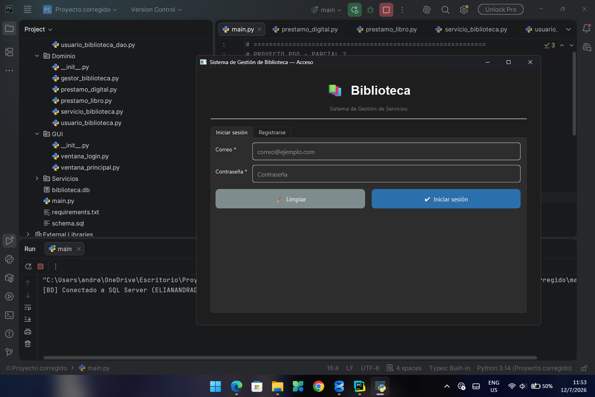
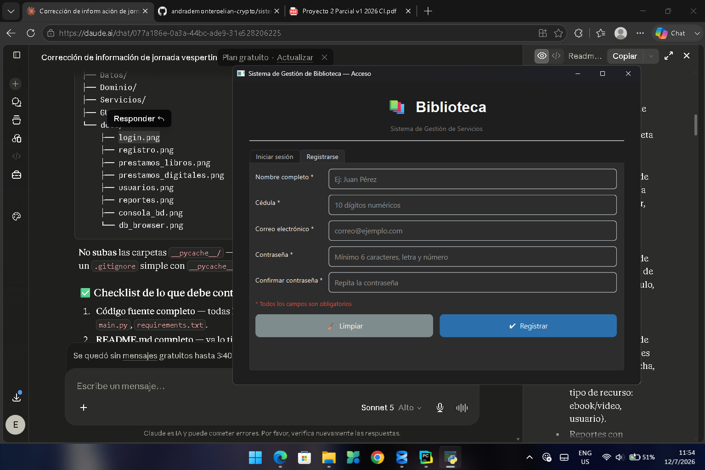
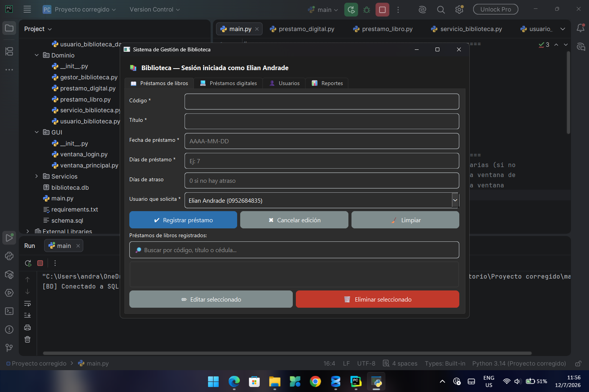
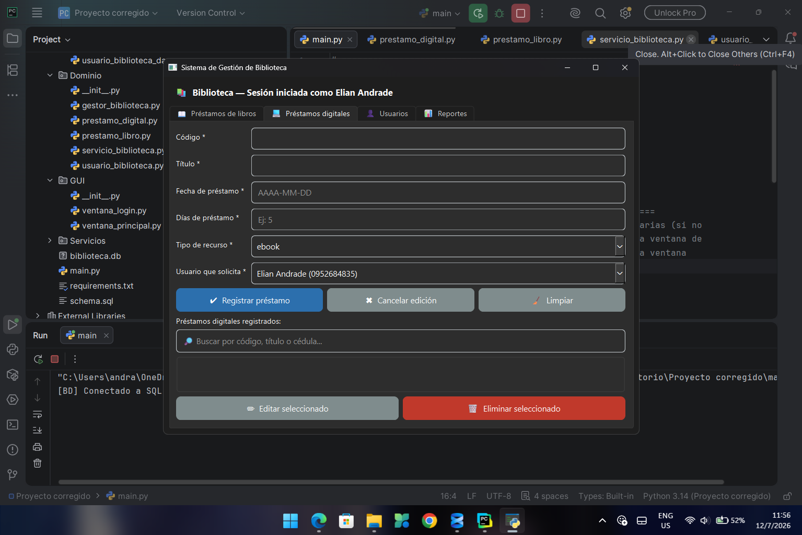
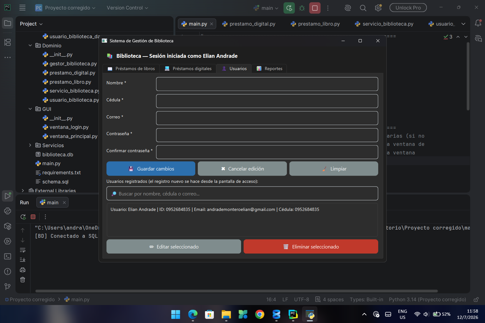
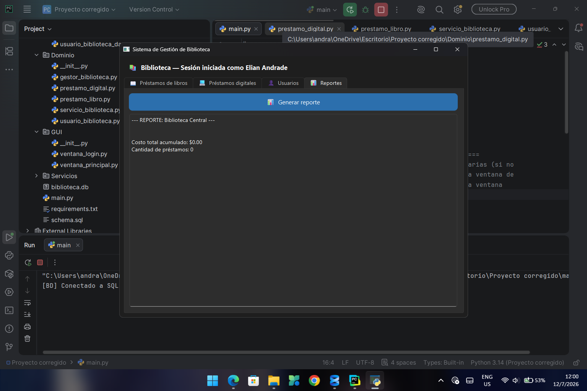
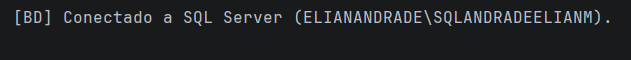
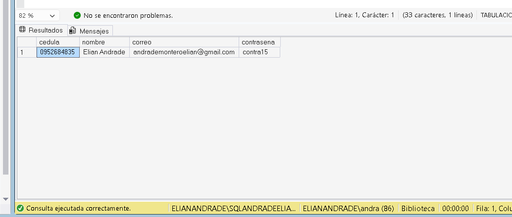
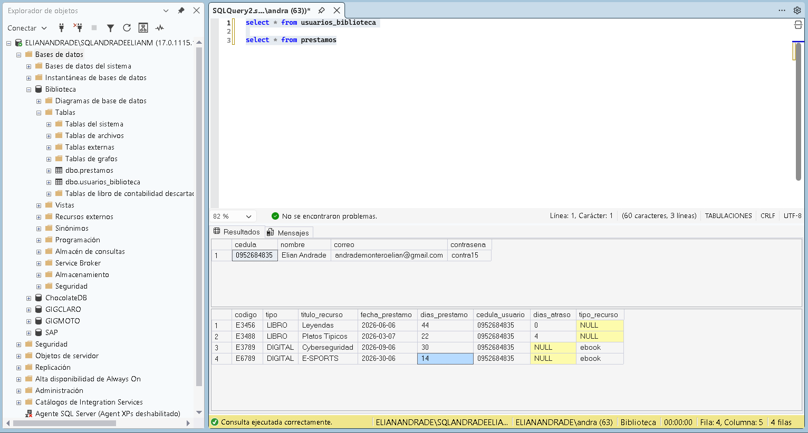

# 📚 Sistema de Gestión de Biblioteca — Proyecto Segundo Parcial

## Descripción general

Sistema de escritorio desarrollado en Python con **PySide6** para la gestión de una
biblioteca. Permite el inicio de sesión y registro de usuarios, el control completo
(crear, consultar, actualizar y eliminar) de **préstamos físicos de libros** y
**préstamos digitales** (ebooks/videos), la generación de reportes con costos
calculados mediante polimorfismo, y guarda toda la información en una base de datos
real (SQL Server, con respaldo automático a SQLite si no hay conexión disponible).

## Integrantes del grupo

- Elian Andrade (Jornada Vespertina)
- Toala Moserrate Juan
- Nacipucha Suarez Nathaly
- Flore Lopez Eylen
- Zambrano Correa Lisseth
- Mazzini Zambrano Jennifer

## Jornada

**Matutina** — Grupo 1
*(Elian Andrade pertenece a la Jornada Vespertina; el resto del grupo cursa la Jornada Matutina).*

## Funcionalidades implementadas

- Login y registro de usuarios, con validación completa contra la base de datos.
- CRUD completo de usuarios (crear vía registro, consultar, editar y eliminar desde la ventana principal).
- CRUD completo de préstamos físicos de libros (código, título, fecha, días de préstamo, días de atraso, usuario).
- CRUD completo de préstamos digitales (código, título, fecha, días de préstamo, tipo de recurso: ebook/video, usuario).
- Reportes con **polimorfismo**: cada tipo de préstamo calcula su propio costo (`calcular_costo()`) y muestra su propia información (`mostrar_info()`).
- Respaldo automático a **SQLite** si no hay conexión disponible a SQL Server, sin que la aplicación falle.
- Botones **"🧹 Limpiar"** en las pestañas de Préstamos de libros, Préstamos digitales y Usuarios, para vaciar el formulario sin afectar el modo de edición.
- Campo de **búsqueda/filtro en tiempo real** en cada una de las tres listas (libros, digitales, usuarios), por código, título, nombre o cédula.

## Tecnologías utilizadas

- **Python 3**
- **QT Designer**
- **PySide6** (interfaz gráfica)
- **pyodbc** (conexión a SQL Server)
- **SQL Server** como motor principal / **SQLite** como respaldo automático

## Instrucciones para ejecutar el proyecto

1. Clonar el repositorio:
   ```bash
   git clone <URL_DEL_REPOSITORIO>
   cd <carpeta_del_proyecto>
   ```
2. Crear y activar un entorno virtual (recomendado):
   ```bash
   python -m venv venv
   venv\Scripts\activate      # Windows
   source venv/bin/activate   # Linux/Mac
   ```
3. Instalar las dependencias:
   ```bash
   pip install -r requirements.txt
   ```
4. (Opcional) Instalar el **ODBC Driver 17 for SQL Server** si se desea usar SQL Server real. Si no se instala o no hay conexión disponible, la aplicación **cae automáticamente a SQLite** (archivo `biblioteca.db`) sin fallar.
5. Ejecutar la aplicación desde la raíz del proyecto:
   ```bash
   python main.py
   ```

## Estructura del proyecto

```
├── main.py            # Punto de entrada: crea tablas y abre la ventana de Login
├── requirements.txt    # Dependencias del proyecto
├── schema.sql          # Script SQL de evidencia de la estructura de la BD
├── biblioteca.db        # Base de datos SQLite de respaldo (se genera/usa automáticamente)
├── Datos/              # Capa de acceso a datos: conexión, respaldo a SQLite y DAOs
│   ├── conexion.py            # Conexión a SQL Server (autenticación de Windows)
│   ├── proveedor_bd.py        # Decide en tiempo de ejecución SQL Server o SQLite
│   ├── usuario_biblioteca_dao.py  # CRUD de usuarios contra la BD
│   └── prestamo_dao.py            # CRUD de préstamos (libro y digital) contra la BD
├── Dominio/            # Capa de negocio: entidades y reglas propias del dominio
│   ├── usuario_biblioteca.py      # Entidad Usuario, con validaciones de propiedades
│   ├── servicio_biblioteca.py     # Clase base de todo préstamo (polimorfismo)
│   ├── prestamo_libro.py          # Préstamo físico (hereda de ServicioBiblioteca)
│   ├── prestamo_digital.py        # Préstamo digital (hereda de ServicioBiblioteca)
│   └── gestor_biblioteca.py       # Agrupa servicios y genera reportes/costos totales
├── Servicios/           # Capa de reglas de negocio y validación (entre GUI y Datos)
│   ├── servicio_usuario_biblioteca.py  # Validaciones y orquestación de usuarios
│   └── prestamo_manager.py             # Validaciones y orquestación de préstamos
└── GUI/                 # Capa de interfaz gráfica (PySide6)
    ├── ventana_login.py       # Ventana de acceso: iniciar sesión / registrarse
    └── ventana_principal.py   # Ventana principal: pestañas de Libros, Digitales, Usuarios y Reportes
```

## Descripción de la base de datos

La base de datos utiliza dos tablas (ver `schema.sql` como script de evidencia):

- **`usuarios_biblioteca`**: `cedula` (clave primaria, 10 dígitos), `nombre`, `correo`, `contrasena`.
- **`prestamos`**: `codigo` (clave primaria), `tipo` (`'LIBRO'` o `'DIGITAL'`), `titulo_recurso`, `fecha_prestamo`, `dias_prestamo`, `cedula_usuario` (clave foránea hacia `usuarios_biblioteca`), `dias_atraso` (solo para libros físicos) y `tipo_recurso` (solo para préstamos digitales: `'ebook'` o `'video'`).

Una sola tabla `prestamos` almacena ambos tipos de préstamo, diferenciándolos con la columna `tipo`, lo que refleja el polimorfismo de la capa de Dominio (`PrestamoLibro` y `PrestamoDigital` heredando de `ServicioBiblioteca`).

## Capturas de pantalla de la GUI









## Evidencia de conexión a la base de datos

Al arrancar, la aplicación imprime en consola un mensaje que confirma cuál motor de base de datos está usando:

- `[BD] Conectado a SQL Server (...)`. si la conexión a SQL Server fue exitosa.
- `[BD] No se pudo conectar a SQL Server. Usando base de datos local (SQLite).` si no hay conexión disponible y se usó el respaldo.






## Enlace al video demostrativo

[Ver video](ENLACE_AQUI)

> Recuerda reemplazar `ENLACE_AQUI` con el enlace real una vez grabado y subido el video (máximo 3 minutos, con todos los integrantes).

## Validaciones implementadas

- **Cédula**: obligatoria, debe tener exactamente 10 dígitos numéricos.
- **Correo electrónico**: obligatorio, debe tener un formato válido (`usuario@dominio.com`).
- **Contraseña**: obligatoria, mínimo 6 caracteres, debe combinar al menos una letra y un número; se exige confirmación y ambas deben coincidir.
- **Campos obligatorios**: nombre, código, título del recurso, fecha de préstamo y usuario solicitante no pueden estar vacíos.
- **Días de préstamo y días de atraso**: deben ser números enteros; los días de préstamo deben ser mayores a cero y los días de atraso no pueden ser negativos.
- **Código de préstamo único**: la base de datos rechaza códigos duplicados (clave primaria).

## Estado final del proyecto

El proyecto está **completo y funcional**, cumpliendo el alcance mínimo de la rúbrica: GUI con login/registro, CRUD completo de usuarios y préstamos (físicos y digitales), conexión real a base de datos con respaldo automático a SQLite, validaciones reales en todos los formularios, botones de limpieza y búsqueda/filtro en las listas.

Quedan como responsabilidad final del usuario/grupo, fuera del alcance de este documento:
- Tomar capturas reales de la GUI y de la base de datos para reemplazar los placeholders de este README.
- Grabar el video demostrativo (máximo 3 minutos, con todos los integrantes).
- Subir el repositorio completo a GitHub.
- Completar el enlace del video en la sección correspondiente.
